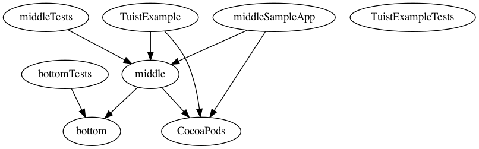

# Tuist Example

- Example app setup using, static libraries and cocoapods.
- Tuist is bundled inside of the project to ensure all users are using the exact same version.


## Setup
- None of the workspaces, project files or podfiles are commited.
- To run checkout and run `.tuist-bin/tuist generate`

- This will generate all the project files, the main workspace (tuist-projects) and do a pod install.

## App setup:

```
TuistExample
	- middle (static lib)
        - SnapKit (pod)
        - bottom (static lib)
    - SDWebImage(pod)
```

Running `tuist graph` gives the following dependencies.
